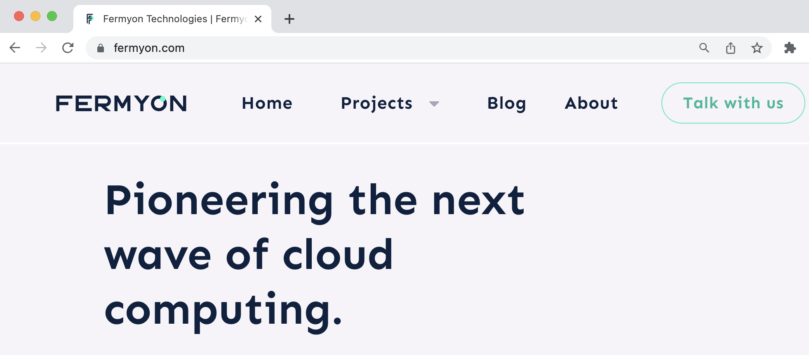

# Bartholomew MicroCMS

Bartholomew is a simple CMS-like tool for hosting a website. It is compiled entirely
to WebAssembly, and can run in any Spin-capable system.

The screenshot below shows how Bartholomew is implemented as the official Fermyon website.

## Bartholomew Documentation

Check out [the docs](https://bartholomew.fermyon.dev/) and please raise any issues or ask any questions; we are here to help :)

------