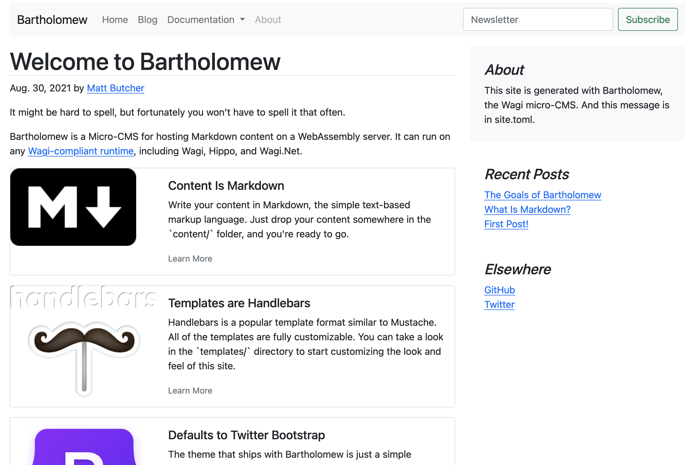

# Bartholomew MicroCMS

Bartholomew is a simple CMS-like tool for hosting a website. It is compiled entirely
to WebAssembly, and can run in any Wagi-capable system.



Check out [the docs](/content/docs)

## Getting Bartholomew

Currently, the best way to get Bartholomew is to fetch this directory. To build 
Bartholomew from source, just run `make build`, which basically does a
`cargo build --target wasm32-wasi --release`.

You can also use the pre-built `batholomew.wasm` or the versioned bindles.

To run Bartholomew, you will need a Wagi-capable runtime.
For example, you can just download a recent release of [Wagi](https://github.com/deislabs/wagi) and put it on your `$PATH`.
Then the `make serve` command can start it all up for you.

### Install the Fileserver

Bartholomew uses an external file server called [Wagi-Fileserver](https://github.com/deislabs/wagi-fileserver/releases).

Download the latest release and put it in the `modules/` directory. When you are done, you should see:

```consle
$ ls modules                                 
README.md          fileserver.gr.wasm
```

## Running Bartholomew

With Wagi:

```
$ wagi -c modules.toml
```

With `make`:

```
$ make serve
```

With Hippo:

```
$ hippo push
```

For convenience, `make serve` builds the code, and then runs `wagi -c`.

### Preview Mode

By default, Bartholomew will not display content that is unpublished.
Content is unpublished if either:

- The article is marked `published = false` in its head
- The article has a publish date in the future

To view unpublished content, turn on `PREVIEW_MODE`.

Wagi:

```
$ wagi -c modules.toml -e PREVIEW_MODE=1
```

Make:

```
$ PREVIEW_MODE=1 make serve
```

Hippo:

Add the environment variable PREVIEW_MODE=1 to the desired channel.

## Configuring Bartholomew

Bartholomew can run inside of any CGI environment that supports directly executing
Wasm modules. That basically means Hippo, Wagi, and Wagi.net. (If you get it running
in another environment, please tell us!)

Bartholomew requires that several directories are mounted into the Wasm module:

- `templates/` should contain Handlebars templates.
- `content/` should contain Markdown files.
- `scripts/` contains Rhai scripts that are available as template helpers.
- `config/site.toml` is the main site configuration file

By convention, we suggest putting all of your Wasm modules in a directory called `modules/`.
However, there is no hard-coded reason why you need to do this.

A `modules.toml` might look something like this:

```toml
[[module]]
module = "target/wasm32-wasi/release/bartholomew.wasm"
route = "/..."
volumes = { "content/" = "content/" , "templates/" = "templates/", "scripts/" = "scripts/", "config/" = "config/"}
```

At the time of this writing, Bartholomew does not serve static files. Instead, use
the [fileserver](https://github.com/deislabs/wagi-fileserver) for Wagi:

```
[[module]]
module = "modules/fileserver.gr.wasm"
route = "/static/..."
volumes = { "/" = "static/"}
```

Using the fileserver has the distinct security advantage that downloadable files are stored
in isolation from executed files like templates.

## Creating Content for Bartholomew

Bartholomew content consists of Markdown documents with TOML headers (aka _Front Matter_):

```
title = "This is the title"
description = "A quick description of the article"
date = "2021-12-23T23:20:57Z"

[extra]
info = "The [extra] section is for your own custom metadata fields. You can use them in templates."

# The three dashes mark the end of the header and the beginning of the content
---

# Hello

This is the markdown content

```

Bartholomew supports Markdown via the [Pulldown-Cmark](https://crates.io/crates/pulldown_cmark)
library.

### Head (Front Matter)

Front matter is fairly basic, limited to a few predefined entries, and a map of custom
name/value pairs. In Bartholomew, we refer to front matter as `head` (_the header_) for brevity.
So you can think of every piece of content as having a _head_ and a _body_.
(Shoulders, knees, and toes will be added in a forthcoming release.)

A typical `head` looks like this:

```
title = "The title"
description = "A short description"
date = "2021-12-23T23:20:57Z"
template = "main" # The default is `main`, which correlates to `templates/main.hbs`

[extra]
key = "your custom name value pairs go hear, but values MUST be strings"

```

### Markdown Body

Markdown support includes all the usual stuff plus fenced codeblocks. Image links are
supported, but you need to use the external [fileserver](https://github.com/deislabs/wagi-fileserver)
library to display the images.

## Templates

Bartholomew uses a [version of the Handlebars template language](https://crates.io/crates/handlebars).
The template syntax is describe in the [Handlebars documentation](https://handlebarsjs.com/).

Every file in the `templates/` directory will be compiled to a template. The file is then
accessible by its relative name, minus the extension. For example. `templates/main.hbs` 
will be accessible as `main`.

Note that Bartholomew _expects_ to find a template named `main`. This template is used as
a default when the content head does not contain a `template` directive. It is also
used when an error occurs. You must have a `main` template.

### Accessing The Head (Front Matter) and the Body

The head is available in the template using the `{{ page.head }}` object.
For example, to print the title, use `{{ page.head.title }}`. To access your custom
`[extra]` field named `foo`, use `{{ page.head.extra.foo }}`.

The body is injected to the template converted to HTML. That is, the template does not
have access to the Markdown version of the document.

To print the HTML body without having the output escaped, use `{{{ page.body }}}` (note the
triple curly braces).
