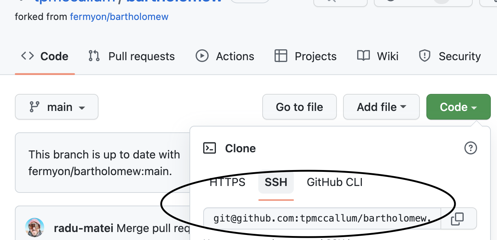
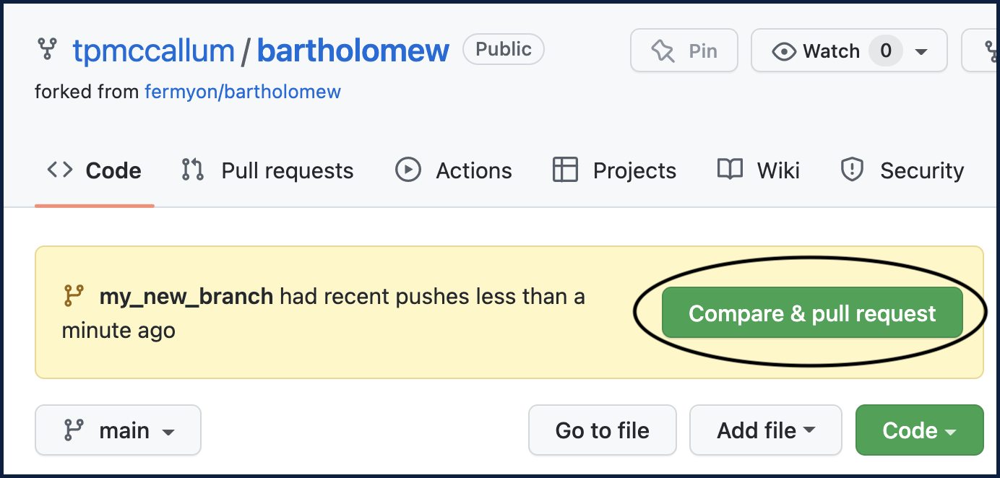
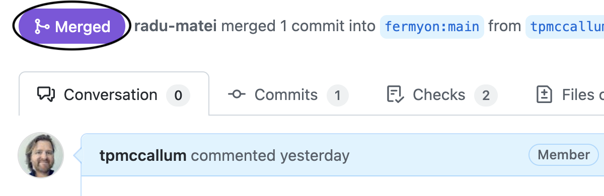

title = "Contributing to Bartholomew"
date = "2022-05-08T14:05:02.118466Z"

[extra]
url = "https://github.com/fermyon/bartholomew/blob/main/docs/content/contributing.md"
---

To contribute to the Bartholomew project, please follow these steps.

> These steps will seperately install (from source) all of the software components that make up a Bartholomew Content Management System (CMS) deployment on localhost. Whilst this page is aimed at showing you how to contribute to Bartholomew, it also demonstrates how all of the different components work together. This is a great way to learn about Spin, Bartholomew, Spin File Server and in addition how the WebAssembly binary files contribute to the workings of this system.

The first step in contributing to Bartholomew is to create a fork of the GitHub repository. Let's get started.

## Create a Fork of the Bartholomew GitHub Repository


Ensure that you are forking Bartholomew to **your own GitHub account**; where you have full editing privileges.

## Clone the Fork

Go ahead and clone the new fork that you just created (the one which resides in your own GitHub account).



Cloning is performed using the following commands:

```bash
# Change into home directory
cd ~
# Clone
git clone git@github.com:yourusername/bartholomew.git
```

Change into the new Bartholomew directory (repo):

```bash
cd ~/bartholomew
```

## Building the Bartholomew Server

Rust and the wasm32-wasi target are prerequisites that are required to build Bartholomew from the source code. Please see the next section if you require these prerequisites on your system.

---

## Prerequisites (Rust, wasm32-wasi and wasm-opt)

You will need Rust installed.
You also need to install and add `wasm32-wasi` target once you have Rust installed.
Lastly, for prerequisites, you will need `wasm-opt`.

**Rust**

Installing Rust via the<a href="https://www.rust-lang.org/tools/install" target="_blank"> official Rust installation tool</a> is recommended.

**wasm32-wasi**

Installing the <a href="https://doc.rust-lang.org/stable/nightly-rustc/rustc_target/spec/wasm32_wasi/index.html" target="_blank">wasm32-wasi</a> target is done using the following commands:

```bash
rustup target install wasm32-wasi
rustup target add wasm32-wasi
```

If you would like more details about the WebAssembly System Interface (WASI) there is an <a href="https://wasi.dev/" target="_blank">official specification</a> and an <a href="https://github.com/bytecodealliance/wasmtime/blob/main/docs/WASI-intro.md" target="_blank">'intro' document</a> available.

**wasm-opt**

Please go to the [latest release page](https://github.com/WebAssembly/binaryen/releases) of binaryen and download the compressed package that suits your specific operating system. Unpack the compressed file to a location of your choice. We are just using `~/` (home directory) for presentation purposes. For example:

```bash
# Download binaryen tar.gz file to home directory first
# Then change into home directory
cd ~
# Unpack .tar.gz
tar -zxvf binaryen-version_109-arm64-macos.tar.gz
```

Once unpacked, ensure that binaryen's bin folder is in your path. For example, open your `.zshrc` or `.bash_profile` file (depending on your OS) for editing:

```bash
# macOS example
vi ~/.zshrc
# Ubuntu Linux example
vi ~/.bash_profile
```

Then add the path to binaryen's bin folder to the last line of your file like this:

```bash
export PATH="${HOME}/binaryen-version_109/bin:${PATH}"
```
Run whichever file you just edited. For example:

```bash
# macOS example
. ~/.zshrc
# Ubuntu Linux example
. ~/.bash_profile
```

You can check this has worked by echoing your path. For example:

```bash
echo $PATH
```

The output from the above command will be similar to the following:

```bash
~/binaryen-version_109/bin:/other/things/in/your/path
```

---

Once the prerequisites are satisfied, you can go ahead and build Bartholomew:

```bash
make build
```

The `make build` command does a `cargo build --target wasm32-wasi --release`.

> `make build` also runs `wasm-opt`, which is part of the [Binaryen](https://webassembly.github.io/binaryen/) project. This reduces the size of the WebAssembly module by optimizing the bytecode.

The above `make build` command creates a `bartholomew.wasm` file in the `bartholomew/target/wasm32-wasi/release` directory. You will need to copy that file into Bartholomew's `modules`/` directory for Spin to run Bartholomew.

## Building the Bartholomew Command Line Interface (CLI) Tool

The Bartholomew Command Line Interface (CLI) Tool is called `bart`. this CLI is different from what we just built above. The CLI is a useful tool that can be used to create a new blog post using a single-line command and more. Installing the Bartholomew CLI is worth it, so take a few seconds to make it happen.

To build the Bartholomew CLI from source, perform the following commands:

```bash
cd ~/bartholomew
make bart
```

Once built, you will find the very useful `bart` CLI executable in the `~/bartholomew/target/release` directory. 

For more information about how to use the CLI, please type `~/bartholomew/target/release/bart --help`, as shown below:

```bash
~/bartholomew/target/release/bart --help    
bart 0.1.0
The Bartholomew CLI

USAGE:
    bart <SUBCOMMAND>

FLAGS:
    -h, --help       Prints help information
    -V, --version    Prints version information

SUBCOMMANDS:
    calendar    Print the content calendar for a Bartholomew website
    check       Check content and identify errors or warnings
    help        Prints this message or the help of the given subcommand(s)
    new         Create a new post
```

The Bartholomew CLI also has some other great features i.e. the `bart` command can automatically check the content (i.e. parse your web page and/or blog post markdown files) and identify & report any issues. See the example of test output below.

## Check Web Pages

```bash
# Note the "bart check" command is being run, as an absolute path, from where we installed bartholomew from source (notice how we are passing in the "content/*" as a parameter to bart's "check" subcommand).
~/bartholomew/target/release/bart check content/*
```

The output from the above command will be similar to the following (depending on the web pages on your system):

```bash
✅ content/about.md
```

## Check Blog Posts

```bash
# Note the "bart check" command is still being run, as an absolute path, from where we installed bartholomew from source (notice how we are passing in the "blog/*" as a parameter to bart's "check" subcommand this time around).
~/bartholomew/target/release/bart check blog/*
```

The output from the above command will be similar to the following (depending on the blog posts on your system):

```bash
✅ content/blog/2022-02-08-hello-world.md
✅ content/blog/why-and-how-wasm-cms-bartholomew.md
```

## The Relationship Between Bartholomew and Spin

To run Bartholomew, you will need a Spin-capable runtime. 

For Spin, follow [the Spin quickstart guide](https://spin.fermyon.dev/quickstart) which details how to either:
- download the latest Spin binary release,
- clone and install Spin using cargo, or
- clone and build Spin from source.

## The Relationship Between Bartholomew and the Spin Fileserver

Bartholomew uses an external file server called [Spin-Fileserver](https://github.com/fermyon/spin-fileserver). This file server facilitates the presentation of files to the end users. For example, whilst the web page contents (HTML) are generated dynamically upon request, image elements in that HTML page source can point to images that are stored on the host server. The Spin file server ensures that these static images are correctly served to the client's web browser (as per the HTML's requirements.)

Please build the spin-fileserver and then copy the resulting `spin_static_fs.wasm` file into Bartholomew's `modules/` directory. This will ensure that you are running the latest release of the spin-fileserver.

## Create a New Branch

Create a new branch that will house all of your changes for this specific contribution:

```bash
git checkout -b my_new_branch
```

## Create a New Remote

Create a new remote for the upstream (a pointer to the original repository to which you are contributing):

```bash
git remote add upstream https://github.com/fermyon/bartholomew
```

## Modify Your Code

Now is the time to make any changes to the code base and/or the documentation. This can include anything from updating files, creating new folders/files, writing documentation, writing tests, adding images and so much more.

## Collaborating When Submitting Your Code And/or Content

Keep in mind that the developers who potentially merge your changes into the original repository will thoroughly check all of your work. There may be some back and forth as the final touches are added and your contribution is polished in readiness to deploy. Fermyon proudly hosts a [code of conduct](https://www.fermyon.com/code-of-conduct) document. Taking a few minutes of your valuable time to view this page would be greatly appreciated.

Also, when contributing, please ensure that you notice any unwritten conventions which are obvious. For example, if an entire folder of images is named using underscores i.e. image_1.png, image_2.png ensure that you don't upload an image with a different format like Image3.png or image-4.png. The same applies to written code, keep an eye out for conventions such as camel case and so forth when creating new variables. This will surely make the collaboration process smoother and faster.

## Testing Your Changes

Once you have made the required changes, test the code to make sure all the test cases are satisfied. You can test the code using the following command in the top-level directory, under which your changes exist. 

```bash
make test
```

### Viewing Your Changes

If you made changes that will have a visual effect when Bartholomew has hosted i.e. changes to page layout and so forth, you can run the Bartholomew instance and view your changes on localhost. When you navigate to `http://localhost:3000`, you should see the website running.

Running Bartholomew using Spin:

```bash
$ spin up
```

Running Bartholomew using make:

```bash
$ make serve
```

For convenience, `make serve` builds the code, and then runs `spin up`.

> Also `spin build --up` could be used, if there is no additional logic on the make file.

### Preview Mode

If you have created changes to a web page or a blog post on a Bartholomew instance, you can preview your changes. For example, if you are contributing to the official documentation and want to render the site locally to preview your changes, you can navigate to the `bartholomew/docs` directory and run the site in preview mode, as shown below.

> Note: By default, Bartholomew will not display unpublished content. Content is unpublished if either:

- The article is marked `published = false` in its head,
- The article has a publish date in the future.

To view unpublished content i.e. if you are creating a new file, turn on `PREVIEW_MODE`.

Spin:

```bash
$ spin up -e PREVIEW_MODE=1
```

Make:

```bash
$ PREVIEW_MODE=1 make serve
```

### The Page Cache

Unless the environment variable `-e DISABLE_CACHE=1` is set, the first load of a site will create a cache of page metadata in `config/_cache.json`. This is an optimization to reduce the number of file IO operations Bartholomew needs to make. If you are actively developing content, we suggest setting `DISABLE_CACHE=1`. By default, the `Makefile`'s `make serve` target disables the cache, as `make serve` is assumed to be used only for developers.

# Adding, Committing and Pushing via Github

Once you are satisfied with your contribution, please ensure that your GitHub installation is configured sufficiently so that you can `--signoff` as part of the `git commit` command. For example, please ensure that the `user.name` and `user.email` are configured in your terminal. You can check if these are set by typing `git config --list`.

If you need to set these values please use the following commands:

```bash
git config user.name "yourname"
git config user.email "youremail@somemail.com"
```

More information can be found at this GitHub documentation page called [signing commits](https://docs.github.com/en/authentication/managing-commit-signature-verification/signing-commits).

## Add Changes

Move to a top-level directory, under which your changes exist i.e. `cd ~/bartholomew`.

Add your changes using the following command:

```bash
git add .
```

## Commit Changes

Type the following commit command to ensure that you sign off (`--signoff`), sign the data (`-S`) - recommended, and also leave a short message (`-m`):

```bash
git commit -S --signoff -m "Updating documentation about testing process"
```

> Note: the `--signoff` option will only add a Signed-off-by trailer by the committer at the end of the commit log message. In addition to this, it is recommended that you use the `-S` option which will GPG-sign your commits. For more information about using GPG in GitHub see [this GitHub documentation](https://docs.github.com/en/authentication/managing-commit-signature-verification/adding-a-gpg-key-to-your-github-account).

## Push Changes
At this stage, it is a good idea to just quickly check what GitHub thinks the `origin` is. For example, if we type `git remote -v` we can see that the origin is our repo; which we a) forked the original repo into and b) which we then cloned to our local disk so that we could edit:

```bash
git remote -v
origin	git@github.com:yourusername/bartholomew.git (fetch)
origin	git@github.com:yourusername/bartholomew.git (push)
```

Next, we push the changes (explicitly mentioning the origin and also the new branch which we created in one of the earlier steps in this tutorial):

```bash
git push -u origin my_new_branch
```

## Create a Pull Request (PR)

If you return to your GitHub repository in your browser, you will notice that a PR has automatically been generated for you.



Clicking on the green "Compare and pull request" button will allow you to add a title and description as part of the PR. You can also add any information in the textbox provided below the title. For example, screen captures and/or code/console/terminal snippets of your contribution working correctly and/or tests passing etc.

There is one final step (another green button to push) ... Create Pull Request!

Once you have finished creating your PR, please keep an eye on the PR; answering any questions as part of the collaboration process.

## Merged

The final stage of a successful contribution will be a notification that the PR has been merged.



## Thank you

At this point, you have performed a significant amount of work which is greatly appreciated. 

Thank you for contributing!

Please keep in touch and contribute again in the future. We would love to see you back here.