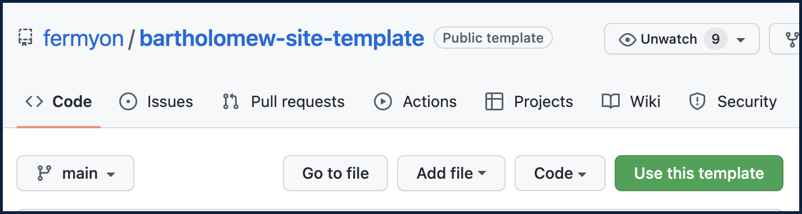
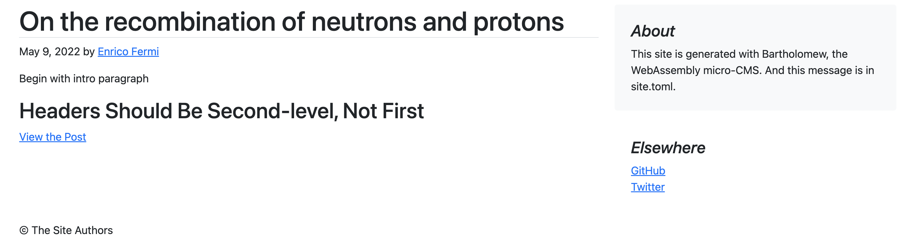

title = "Taking Bartholomew for a spin"
date = "2022-05-08T14:05:02.118466Z"

[extra]
url = "https://github.com/fermyon/bartholomew/blob/main/docs/content/quickstart.md"
---
This is a quickstart example of using Spin to deploy a Bartholomew CMS instance, locally on your machine. In this quickstart session, we use a Bartholomew site template which contains some pre-built parts (for your convenience). If you would like to build all of the parts separately from source (Spin, Bartholomew, File Server), please see the [contributing section](https://bartholomew.fermyon.dev/contributing) which dives a lot deeper than this quickstart example.

## Getting the `spin` Binary

For Spin, follow [the Spin quickstart guide](https://spin.fermyon.dev/quickstart) which details how to either:
- download the latest Spin binary release,
- clone and build Spin using cargo, or
- clone and build Spin from source.

## Templates

This quickstart method uses a Bartholomew site template. So while we do require `spin` (as per the details above) everything else we need (to launch our Bartholomew CMS website) is packaged up in the Bartholomew site template. Including the `bartholomew.wasm` and the `spin_static_fs.wasm` files which take care of Bartholomew's business logic and [Spin's file server](https://github.com/fermyon/spin-fileserver) needs, respectively. We will start working with the template in the next section.

## Use the Bartholomew Site Template

We can now generate a new repository with the same directory and file structure as the aforementioned Bartholomew site template. Simply visit [the template's location](https://github.com/fermyon/bartholomew-site-template) on [GitHub](https://github.com/fermyon/bartholomew-site-template). Then click on the green `Use this template` button and follow the prompts. This will create a new repository in your GitHub account.

Here are some additional details about [creating a repository from a template](https://docs.github.com/en/repositories/creating-and-managing-repositories/creating-a-repository-from-a-template) if you are interested.



## Fetch Your Site

Clone the repository which you created in the previous step: 

```bash
$ git clone <your-github-account> <your-repo-name>
```

Navigate into your newly cloned repository:

```bash
$ cd <your-repo-name>
```

## Spin Up Your Site

Issue the following `spin up` command to launch your site on localhost:

```bash
$ spin up --follow-all
```

When you navigate to `http://localhost:3000`, you should see the website running.

## Creating Your Content

Creating content is made easy with the Bartholomew Command Line Interface (CLI) tool. The Bartholomew CLI can create new blog posts in a single command and also validate the content (Markdown files) that you write. Let's go ahead and install the Bartholomew CLI.

### Bartholomew CLI

For the `bart` CLI, there are two options:
- download the latest `bart` binary [release](https://github.com/fermyon/bartholomew/releases/), or
- clone and build `bart` from source (requires Rust), using the following commands (NOTE: `target/release/bart` will need to be installed to a user executable directory such as `/usr/local/bin/` to be run when built this way.):

```bash
$ git clone https://github.com/fermyon/bartholomew.git
$ cd bartholomew
$ make bart
```

## Create Your First Blog Post

You are now ready to start adding content to your new website. You will recall that we installed the `bart` CLI in a previous step. We can use this CLI to create a new blog post page.

Note below how we:
- set the location where the post will be created i.e. `content/blog`,
- set the name of the blog file `protons.md`, and
- specify the `author`, `template` style and `title`.

Feel free to change these values when you run the command on your system:

```bash
$ mkdir content/blog
$ bart new post content/blog protons.md --author "Enrico Fermi" --template "blog" --title "On the Recombination of Neutrons and Protons"
```

The output from the above command will look similar to the following:

```bash
Wrote new post in file content/blog/protons.md
```

## Validate Your Content

If you would like to check the validity of your content, you can use the following `bart check` command. Notice how we specify the location of the content we want to check. In this case, we are checking all of the Markdown files in the blog directory:

```bash
bart check content/blog/*
```

If your syntax in the `.md` file is **correct**, you will receive an output similar to the following. Otherwise, you will receive an informative error message and a cross:

```bash
✅ content/blog/protons.md
```

### Validating content with shortcodes

If some of your documents uses shortcodes, then directory from which the shortcodes must be loaded needs to be specified using the `--shortcodes` flag.

```bash
bart check content/blog/* --shortcode ./shortcodes
```

## Viewing Your Changes

Running the `spin up` command from above (again) will render the post content at `http://localhost:3000/blog/protons`



Next, let's explore how to [build custom templates for our new website](./templates.md).
